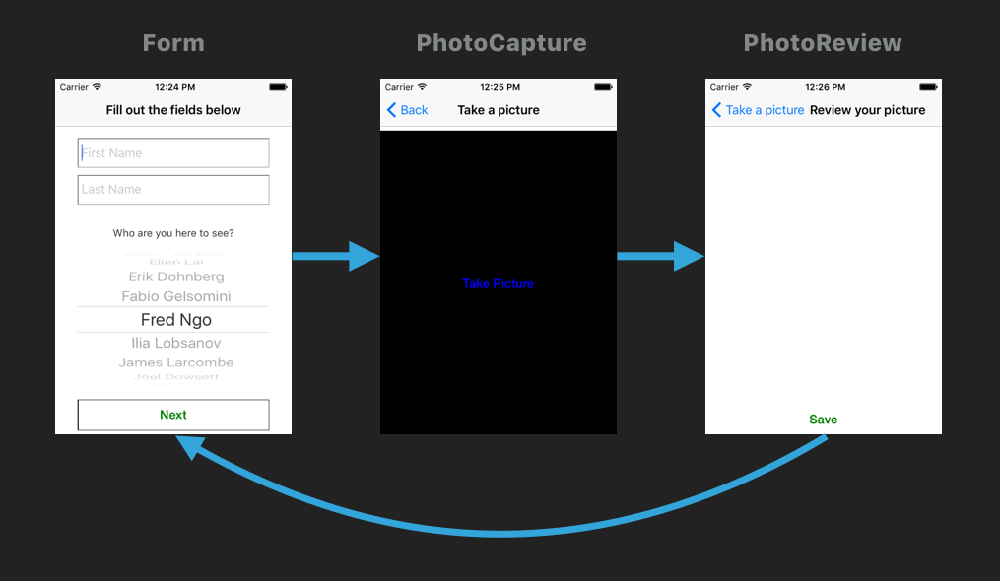

# ReceptionApp

Imagine you are visiting a brick'n'mortar office of some organization. Imagine that organization is Bitmaker. You go up the stairs to the second floor and you see an iPad mounted next to the entrance door. You fill out your name and select who you're there to see: Erik. You let the iPad snap a photo of yourself and hit Submit. Erik gets a notification on his phone and you are shortly reunited with Erik.

ReceptionApp is an iOS app implemented using React Native. This is the app that would run on the iPad.

It depends on the [reception web service](https://github.com/bitmakerlabs/reception)
to store the visit data.

## Scene Flow

## Setup

### Prerequisites
* Mac OS X 10.11
* Xcode 7.1.1+
* Node and NPM

## How to run in Simulator

* open ios/ReceptionApp.xcodeproj
* In Xcode, select an iOS Simulator and Run (CMD+R)

## How to run on device

* open ios/ReceptionApp.xcodeproj
* Connect your device (eg. iPad) over USB
* In Xcode, select the device and Run (CMD+R)

## LICENSE and COPYRIGHT

Licensed under the BSD license. See more details at [LICENSE.txt](LICENSE.txt)

